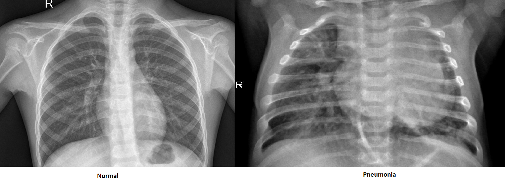

# PneumoniaImageClassification
This project was run on a dataset of Chest X-rays to classify whether a person is normal or diagnosed with bacterial or viral pneumonia. The dataset was downloaded from (https://www.kaggle.com/paultimothymooney/chest-xray-pneumonia). The images were rearranged to make three classes. VGG16 model was used to run the classification. The choice of the optimizer was Adam with a learning rate of 0.0001. Crossentropyloss was used as the loss function. The whole implementaton was done using Pytorch.
## Dataset
As mentioned in the introduction that the dataset was downloaded from kaggle. It was rearranged so that we could make a csv file containing the labels. The CSV file was generated by importing os and csv in python. You may use any method you like. The csv file is attached in the files.

## Dataset Preview

## Training
CrossEntropyLoss was used along with an Adam optimizer. The learning rate was set to 0.001 and later reduced to 0.0001. VGG16() model was used for the training. The model was trained for 100 epochs. After training, an accuracy of 99 percent was achieved. 
## Visualization
Matplotlib and Tensorboard were integrated in the code to visualize the dataset as well as the model. You can use the command `tensorboard --logdir=graphs` to get a link through anaconda and then visualize it on the browser.
